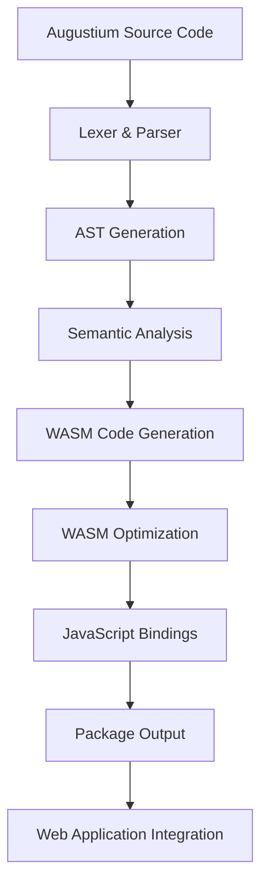

# Augustium WebAssembly Compiler - Product Requirements Document

## 1. Product Overview

The Augustium WebAssembly Compiler is a compilation target that enables Augustium smart contracts to run in web browsers and JavaScript environments through WebAssembly. This compiler extends the existing Rust-based Augustium compiler infrastructure to generate WASM bytecode, providing seamless integration with web applications and enabling client-side smart contract execution.

The primary goal is to bridge blockchain smart contract development with web technologies, allowing developers to write Augustium contracts that can be executed both on-chain and in browser environments for testing, simulation, and decentralized application development.

## 2. Core Features

### 2.1 User Roles

| Role                     | Registration Method             | Core Permissions                                                                   |
| ------------------------ | ------------------------------- | ---------------------------------------------------------------------------------- |
| Smart Contract Developer | Direct access through CLI/API   | Can compile Augustium contracts to WASM, access all compiler features              |
| Web Developer            | JavaScript package installation | Can integrate WASM modules into web applications, execute contracts in browser     |
| DApp Developer           | Combined access                 | Can develop full-stack blockchain applications with client-side contract execution |

### 2.2 Feature Module

Our WebAssembly compiler requirements consist of the following main components:

1. **WASM Compilation Engine**: Core compiler backend, bytecode generation, optimization pipeline
2. **JavaScript Bindings Interface**: WASM module wrapper, type conversion utilities, async execution support
3. **Development Tools**: CLI integration, build configuration, debugging support
4. **Documentation Portal**: API reference, integration guides, example implementations
5. **Testing Framework**: Unit test runner, integration test suite, performance benchmarks

### 2.3 Page Details

| Page Name                     | Module Name               | Feature description                                                                                                                                      |
| ----------------------------- | ------------------------- | -------------------------------------------------------------------------------------------------------------------------------------------------------- |
| WASM Compilation Engine       | Core Compiler Backend     | Compile Augustium AST to WebAssembly bytecode, integrate with existing codegen pipeline, support all Augustium language features including ML operations |
| WASM Compilation Engine       | Bytecode Generation       | Generate optimized WASM instructions, handle memory management, implement stack-based execution model                                                    |
| WASM Compilation Engine       | Optimization Pipeline     | Apply WASM-specific optimizations, dead code elimination, instruction combining, size reduction                                                          |
| JavaScript Bindings Interface | WASM Module Wrapper       | Create JavaScript wrapper classes, expose contract methods, handle async operations                                                                      |
| JavaScript Bindings Interface | Type Conversion Utilities | Convert between JavaScript and WASM types, handle complex data structures, support Augustium-specific types                                              |
| JavaScript Bindings Interface | Async Execution Support   | Implement Promise-based API, handle long-running operations, support event callbacks                                                                     |
| Development Tools             | CLI Integration           | Extend augustc CLI with WASM target, add build commands, support configuration files                                                                     |
| Development Tools             | Build Configuration       | Implement wasm-pack integration, support custom build scripts, handle dependencies                                                                       |
| Development Tools             | Debugging Support         | Generate source maps, provide error reporting, support browser debugging tools                                                                           |
| Documentation Portal          | API Reference             | Document JavaScript API, provide type definitions, include usage examples                                                                                |
| Documentation Portal          | Integration Guides        | Create step-by-step tutorials, provide boilerplate code, explain best practices                                                                          |
| Documentation Portal          | Example Implementations   | Showcase real-world use cases, provide sample projects, demonstrate advanced features                                                                    |
| Testing Framework             | Unit Test Runner          | Test individual WASM functions, validate type conversions, verify contract logic                                                                         |
| Testing Framework             | Integration Test Suite    | Test full compilation pipeline, validate JavaScript integration, check cross-browser compatibility                                                       |
| Testing Framework             | Performance Benchmarks    | Measure compilation speed, compare WASM vs native performance, track optimization improvements                                                           |

## 3. Core Process

### Developer Workflow

1. **Contract Development**: Developer writes Augustium smart contract using existing language features
2. **WASM Compilation**: Developer runs `augustc --target wasm contract.aug` to generate WASM module
3. **JavaScript Integration**: Developer imports generated WASM module into web application
4. **Contract Execution**: Web application instantiates and executes contract methods in browser
5. **Testing & Debugging**: Developer uses browser dev tools and provided debugging utilities

### Build Process Flow

1. **Source Parsing**: Existing lexer and parser process Augustium source code
2. **AST Generation**: Abstract syntax tree created using current AST infrastructure
3. **Semantic Analysis**: Type checking and validation using existing semantic analyzer
4. **WASM Code Generation**: New WASM backend generates WebAssembly instructions
5. **Optimization**: WASM-specific optimizations applied to bytecode
6. **Module Generation**: Final WASM module created with JavaScript bindings
7. **Package Output**: Generated files packaged for distribution

## 4. User Interface Design

### 4.1 Design Style

* **Primary Colors**: Deep blue (#1a365d) for technical elements, bright green (#38a169) for success states

* **Secondary Colors**: Gray (#718096) for secondary text, red (#e53e3e) for errors

* **Button Style**: Rounded corners with subtle shadows, hover animations

* **Font**: Monospace fonts (Fira Code, Consolas) for code, sans-serif (Inter, Roboto) for UI text

* **Layout Style**: Clean terminal-inspired interface with card-based documentation sections

* **Icon Style**: Minimalist line icons with consistent stroke width, technical/developer-focused symbols

### 4.2 Page Design Overview

| Page Name                     | Module Name           | UI Elements                                                                         |
| ----------------------------- | --------------------- | ----------------------------------------------------------------------------------- |
| WASM Compilation Engine       | Core Compiler Backend | Terminal-style output display, progress indicators, syntax-highlighted code blocks  |
| JavaScript Bindings Interface | WASM Module Wrapper   | Code editor with autocomplete, interactive API explorer, live preview pane          |
| Development Tools             | CLI Integration       | Command palette interface, tabbed terminal views, file tree navigation              |
| Documentation Portal          | API Reference         | Searchable documentation tree, interactive code examples, copy-to-clipboard buttons |
| Testing Framework             | Unit Test Runner      | Test result dashboard, coverage visualization, performance graphs                   |

### 4.3 Responsiveness

Desktop-first design optimized for development environments with responsive breakpoints for tablet viewing. Touch interaction support for mobile documentation browsing, though primary usage expected on desktop development setups.

## 5. Technical Implementation

### 5.1 Architecture Overview

The WASM compiler extends the existing Augustium compiler infrastructure by adding a new compilation target. The implementation leverages Rust's `wasm-pack` toolchain and integrates with the current codegen module.

### 5.2 Key Components

* **WASM Backend**: New codegen target in `src/codegen/wasm.rs`

* **JavaScript Bindings**: Generated bindings in `wasm/pkg/` directory

* **Build Tools**: Extended CLI commands and configuration

* **Type System**: WASM-compatible type mappings for Augustium types

* **Runtime**: Minimal WASM runtime for contract execution

### 5.3 Integration Points

* Extends existing `Instruction` enum with WASM-specific operations

* Integrates with current AST and semantic analysis phases

* Utilizes existing error handling and debugging infrastructure

* Maintains compatibility with current ML and blockchain features

## 6. Success Metrics

* **Compilation Speed**: Target <5 seconds for typical smart contracts

* **WASM Size**: Generated modules under 1MB for standard contracts

* **Browser Compatibility**: Support for all modern browsers (Chrome, Firefox, Safari, Edge)

* **Developer Adoption**: Integration in at least 3 sample DApp projects

* **Performance**: WASM execution within 2x of native Rust performance

